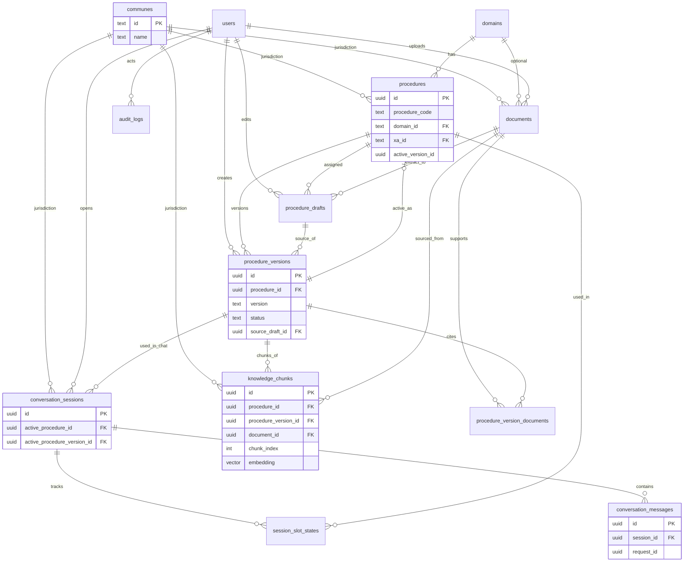

# Data Model (PostgreSQL + pgvector) — V1 **FROZEN**

`xa_id` FK → `communes.id` (V1: 1 xã; schema sẵn multi-xã).

**Nguyên tắc identity**

| | Technical pointer | Human-readable |
|--|-------------------|----------------|
| Procedure | `procedures.id` uuid — FK tên `procedure_id` | `procedure_code` e.g. `dk_khai_sinh` |
| Version | `procedure_versions.id` uuid | `version` e.g. `1.0.0` |

`UNIQUE (xa_id, procedure_code)` — cùng mã thủ tục được phép ở hai xã khác nhau.

Composite FK `(procedure_id, version_id)` đảm bảo không lệch procedure ↔ version.

> Không chỉnh ER tiếp trừ bug thật. Tiếp theo = `001_init_schema.up.sql` + Phase 1.

## 1. ER overview

```text
communes
  ├── procedures          (xa_id FK; id uuid PK; procedure_code)
  ├── documents
  ├── conversation_sessions
  └── knowledge_chunks

domains                     ← catalog độc lập (không thuộc communes)
  ├── procedures
  └── documents

procedures
  ├── active: composite FK (id, active_version_id)
  │              → procedure_versions(procedure_id, id)
  └── procedure_versions
        ├── source_draft_id → procedure_drafts
        ├── procedure_version_documents → documents
        └── knowledge_chunks  vector(1536) + chunk_index

users
  └── conversation_sessions
        ├── active: composite FK (active_procedure_id, active_procedure_version_id)
        ├── conversation_messages  (+ request_id uuid)
        └── session_slot_states

audit_logs  (+ request_id uuid null)
```

## 2. Tracing — chỉ `session_id` + `request_id`

**Không** dùng `correlation_id` trong V1.

| ID | Scope |
|----|-------|
| `session_id` | Cả hội thoại |
| `request_id` | 1 HTTP / 1 turn (Web → Go → Python → LLM → DB/log) |

Messages: `request_id uuid NOT NULL`. Audit: `uuid null` (job/migration).

---

## 3. Embedding lock (V1)

| Hạng mục | Giá trị |
|----------|---------|
| Model | `text-embedding-3-small` (OpenAI) |
| Dimension | **1536** → `vector(1536)` |
| Đổi sau | Re-embed toàn bộ + migration |

---

## 4. ER diagram



## 5. Tables

### `communes`

| Column | Type | Notes |
|--------|------|-------|
| id | text PK | = `xa_id`, e.g. `xa_demo_001` |
| name | text | |
| description | text null | |
| is_active | boolean | default true |
| created_at | timestamptz | |

**Seed V1:** 1 row.

---

### `domains`

| Column | Type | Notes |
|--------|------|-------|
| id | text PK | |
| name | text | |
| description | text null | |
| sort_order | int | default 0 |
| is_active | boolean | default true |
| created_at | timestamptz | |

**Seed:** `ho_tich_chung_thuc`, `dat_dai_nha_o_quy_hoach`, `bao_hiem_chinh_sach_xh`.

---

### `users`

| Column | Type | Notes |
|--------|------|-------|
| id | uuid PK | |
| role | text | `CHECK (role IN ('citizen', 'admin'))` |
| full_name | text | |
| email | text null | unique khi not null |
| phone | text null | |
| password_hash | text null | |
| created_at / updated_at | timestamptz | |

---

### `procedures`

| Column | Type | Notes |
|--------|------|-------|
| **id** | **uuid PK** | Technical identity — mọi FK gọi là `procedure_id` |
| **procedure_code** | **text NOT NULL** | Human code, e.g. `dk_khai_sinh` |
| domain_id | text FK → domains.id | |
| name | text | |
| xa_id | text FK → communes.id | |
| active_version_id | uuid null | |
| created_at | timestamptz | NOT NULL DEFAULT now() |
| updated_at | timestamptz | NOT NULL DEFAULT now() |
| **unique** | **`(xa_id, procedure_code)`** | Multi-xã: cùng code, khác xã |
| **unique** | **`(id, xa_id)`** | Hỗ trợ composite FK denorm `xa_id` trên chunks/sessions |

```sql
-- Composite FK: active version phải thuộc đúng procedure
FOREIGN KEY (id, active_version_id)
  REFERENCES procedure_versions (procedure_id, id)
```

API resolve: `(xa_id, procedure_code)` → `procedures.id`.

JSON definition dùng field **`procedure_code`** (không còn nhầm với uuid).

---

### `procedure_versions`

| Column | Type | Notes |
|--------|------|-------|
| id | uuid PK | |
| procedure_id | uuid FK → procedures.id | |
| version | text | semver |
| status | text | `CHECK (... IN ('approved', 'indexing', 'active', 'archived'))` |
| definition | jsonb | chứa `procedure_code`, slots, … |
| source_draft_id | uuid null FK → procedure_drafts.id | |
| created_by | uuid FK → users | |
| approved_by | uuid FK → users null | |
| created_at / approved_at | timestamptz | |
| **unique** | `(procedure_id, version)` | |
| **unique** | `(procedure_id, id)` | cho composite FK |
| **partial unique** | `(procedure_id) WHERE status = 'active'` | |
| **partial unique** | `(source_draft_id) WHERE source_draft_id IS NOT NULL` | **1 draft → 1 version** |

Publish: một approved draft → một immutable version. Version mới = draft mới (revise). Seed/manual: `source_draft_id = NULL` (không bị unique chặn).

**Lifecycle status (không có `failed`):**

```text
approved
    │
    ▼
indexing
   / \
fail   success
 │        │
 ▼        ▼
approved  active
            │
            ▼
         archived
```

Fail embedding → cleanup chunks → `status = approved` → retry được.

---

### `procedure_version_documents`

| Column | Type | Notes |
|--------|------|-------|
| procedure_version_id | uuid FK | PK composite |
| document_id | uuid FK | PK composite |

Tạo **trước** bước chunk/embed (xem §6).

**Scope commune — app-level (không composite FK V1):** publish service verify `document.xa_id == procedure.xa_id` trước khi INSERT. Không ép FK cứng vì sau này có thể có VB tỉnh/QG dùng chung nhiều xã.

---

### `documents`

| Column | Type | Notes |
|--------|------|-------|
| id | uuid PK | |
| xa_id | text FK → communes.id | |
| domain_id | text FK → domains null | |
| title | text | |
| document_number | text null | |
| issuer | text null | |
| filename | text | |
| storage_uri | text | |
| checksum | text | |
| effective_date / expire_date / issued_date | date null | |
| processing_status | text | `uploaded` \| `processing` \| `processed` \| `failed` |
| validity_status | text | `pending` \| `valid` \| `expired` \| `superseded` |
| uploaded_by | uuid FK → users | |
| created_at / updated_at | timestamptz | |

**Migration CHECK:**

```sql
CHECK (
  effective_date IS NULL
  OR expire_date IS NULL
  OR expire_date >= effective_date
)
```

---

### `procedure_drafts`

| Column | Type | Notes |
|--------|------|-------|
| id | uuid PK | |
| document_id | uuid FK → documents null | |
| procedure_id | uuid null FK → procedures.id | gán sau review |
| draft_definition | jsonb | |
| validation_result | jsonb | |
| status | text | `draft` \| `reviewed` \| `approved` \| `rejected` \| `published` |
| created_by / updated_by | uuid FK → users | |
| created_at / updated_at | timestamptz | |

---

### `knowledge_chunks` (pgvector)

| Column | Type | Notes |
|--------|------|-------|
| id | uuid PK | |
| xa_id | text FK → communes.id | |
| procedure_id | uuid | denorm; khóa bằng composite FK |
| procedure_version_id | uuid | |
| **document_id** | **uuid NOT NULL FK → documents** | V1: chunk luôn từ document (tránh UNIQUE NULL) |
| **chunk_index** | **int NOT NULL** | 0-based trong document |
| content | text | |
| metadata | jsonb | page, heading, embedding_model, … |
| embedding | vector(1536) | |
| created_at | timestamptz | |

```sql
FOREIGN KEY (procedure_id, procedure_version_id)
  REFERENCES procedure_versions (procedure_id, id)

-- Denorm xa_id không được lệch commune của procedure
FOREIGN KEY (procedure_id, xa_id)
  REFERENCES procedures (id, xa_id)

UNIQUE (procedure_version_id, document_id, chunk_index)
```

Citation/debug: Document A → chunk 0, 1, 2, …

---

### `conversation_sessions`

| Column | Type | Notes |
|--------|------|-------|
| id | uuid PK | |
| user_id | uuid FK → users null | |
| guest_token | text null | UNIQUE WHERE NOT NULL |
| xa_id | text FK → communes.id | |
| active_procedure_id | uuid null FK → procedures.id | |
| active_procedure_version_id | uuid null | |
| status | text | `open` \| `completed` \| `abandoned` |
| created_at / updated_at | timestamptz | |

```sql
CHECK (
  (active_procedure_id IS NULL AND active_procedure_version_id IS NULL)
  OR (active_procedure_id IS NOT NULL AND active_procedure_version_id IS NOT NULL)
)

FOREIGN KEY (active_procedure_id, active_procedure_version_id)
  REFERENCES procedure_versions (procedure_id, id)

-- Khi đã chọn procedure: xa_id session phải khớp procedure
FOREIGN KEY (active_procedure_id, xa_id)
  REFERENCES procedures (id, xa_id)
```

(MATCH SIMPLE: khi `active_procedure_id` NULL thì FK commune-procedure không check — session vẫn có `xa_id` hợp lệ qua FK → communes.)

---

### `conversation_messages`

| Column | Type | Notes |
|--------|------|-------|
| id | uuid PK | |
| session_id | uuid FK | |
| request_id | uuid NOT NULL | |
| role | text | `user` \| `assistant` \| `system` |
| content | text | |
| action | text null | |
| message_metadata | jsonb | |
| created_at | timestamptz | |

---

### `session_slot_states`

Slot schema nằm trong **procedure_version.definition**, không chỉ trên procedure. Phải pin version.

| Column | Type | Notes |
|--------|------|-------|
| session_id | uuid FK → conversation_sessions ON DELETE CASCADE | |
| procedure_id | uuid | |
| **procedure_version_id** | **uuid NOT NULL** | Version đã dùng để collect slots |
| slot_state | jsonb | map slot → `{ value, status }` |
| updated_at | timestamptz | |
| **PK** | `(session_id, procedure_id)` | 1 row / procedure / session |

```sql
FOREIGN KEY (procedure_id, procedure_version_id)
  REFERENCES procedure_versions (procedure_id, id)
```

**Runtime V1:** một procedure trong session gắn version nào lúc bắt đầu thì **giữ version đó** đến hết flow (khớp `conversation_sessions.active_procedure_version_id`). Không âm thầm reuse slot state khi catalog đổi active version. Đổi version giữa chừng = **reset** slot state (hoặc migrate tường minh — không làm V1).

```text
Session.active_procedure_version_id = V003
        ↓
V003.definition.required_slots
        ↓
slot_state (procedure_version_id = V003)
        ↓
Decision Policy
```

---

### `audit_logs`

| Column | Type | Notes |
|--------|------|-------|
| id | bigserial PK | |
| request_id | uuid null | |
| actor_user_id | uuid FK → users null | |
| action | text | |
| entity_type | text | |
| entity_id | text | |
| payload | jsonb | |
| created_at | timestamptz | |

---

## 6. Publish flow

```text
Draft approved
       ↓
Create procedure_versions (status = indexing)
       + source_draft_id
       ↓
Create procedure_version_documents (N–N links)
       │  app-check: document.xa_id == procedure.xa_id
       ↓
Chunk documents → embed (ngoài txn dài / batch)
       ↓
INSERT knowledge_chunks (chunk_index, document_id NOT NULL)
       ↓
SHORT TXN activate (atomic)
```

### Embedding fail / retry

```text
embedding fail (partial chunks có thể đã insert)
      ↓
DELETE FROM knowledge_chunks
 WHERE procedure_version_id = :version_id
      ↓
UPDATE procedure_versions SET status = 'approved'
 WHERE id = :version_id
      ↓
retry từ đầu (chunk + embed)
```

UNIQUE `(procedure_version_id, document_id, chunk_index)` chống duplicate nếu retry kém; **vẫn cleanup** cho đơn giản V1.

### Short transaction (activate)

```text
BEGIN
  archive old active (cùng procedure_id)
  SET new.status = 'active'
  UPDATE procedures
    SET active_version_id = new.id
    WHERE id = new.procedure_id
  UPDATE procedure_drafts
    SET status = 'published'
    WHERE id = new.source_draft_id   -- nếu có
  INSERT audit_logs (action = 'publish', ...)
COMMIT
```

Không được để `version = active` mà `draft = approved` vì process chết giữa chừng.

### Publish validation (Go — app-level)

Trước khi tạo version / activate:

```text
VERIFY draft.status = 'approved'
VERIFY draft.procedure_id == target procedure_id   -- chống source_draft lệch procedure
VERIFY source documents validity_status hợp lệ
VERIFY document.xa_id == procedure.xa_id          -- scope commune
```

Không thêm composite FK `source_draft` ↔ `procedure` (V1 đủ bằng verify).

---

## 6b. Chat version pin (slot state)

```text
DETECT procedure → pin active_procedure_version_id trên session
                 → UPSERT session_slot_states với cùng procedure_version_id
Decision đọc definition của version đã pin (không đọc “active mới nhất” của catalog)
```

## 7. Debug recipes

```sql
-- resolve code → uuid
SELECT id FROM procedures
WHERE xa_id = :xa AND procedure_code = 'dk_khai_sinh';

SELECT * FROM conversation_messages WHERE request_id = :rid;
SELECT * FROM conversation_messages WHERE session_id = :sid ORDER BY created_at;

SELECT pv.*
FROM procedures p
JOIN procedure_versions pv
  ON pv.id = p.active_version_id AND pv.procedure_id = p.id
WHERE p.xa_id = :xa AND p.procedure_code = 'dk_khai_sinh';

SELECT * FROM knowledge_chunks
WHERE procedure_version_id = :vid
ORDER BY document_id, chunk_index;
```

## 8. Constraints & indexes

| Rule | Enforce |
|------|---------|
| Multi-xã procedure code | `UNIQUE (xa_id, procedure_code)` |
| 1 draft → 1 version | partial `UNIQUE (source_draft_id) WHERE NOT NULL` |
| draft ↔ version cùng procedure | **app-level** publish VERIFY |
| procedure ↔ version | composite FK |
| slot state ↔ version | composite FK trên `session_slot_states` |
| chunk / session `xa_id` ↔ procedure | `UNIQUE (procedures.id, xa_id)` + composite FK |
| version ↔ document cùng xã | **app-level** publish |
| Session active cặp | CHECK both null / both set |
| Chunk idempotent | `UNIQUE (version_id, document_id, chunk_index)` |
| Document dates | `expire_date >= effective_date` |
| State machines | **CHECK IN (...)** mọi status/role (migration; không dùng PG ENUM) |
| 1 active / procedure | partial unique + short txn |
| Embed fail | delete chunks → `approved` |

```text
procedures (xa_id, procedure_code) UNIQUE
procedures (id, xa_id) UNIQUE
procedures (id, active_version_id) composite FK
procedure_versions (source_draft_id) UNIQUE WHERE NOT NULL
conversation_sessions (active_procedure_id, active_procedure_version_id)
conversation_sessions (active_procedure_id, xa_id) → procedures(id, xa_id)
session_slot_states (procedure_id, procedure_version_id) → procedure_versions
knowledge_chunks (procedure_id, procedure_version_id)
knowledge_chunks (procedure_id, xa_id) → procedures(id, xa_id)
knowledge_chunks (procedure_version_id, document_id, chunk_index) UNIQUE
knowledge_chunks USING hnsw (embedding vector_cosine_ops)

-- CHECK examples (migration)
procedure_versions.status IN ('approved','indexing','active','archived')
documents.processing_status IN ('uploaded','processing','processed','failed')
documents.validity_status IN ('pending','valid','expired','superseded')
procedure_drafts.status IN ('draft','reviewed','approved','rejected','published')
conversation_sessions.status IN ('open','completed','abandoned')
conversation_messages.role IN ('user','assistant','system')
users.role IN ('citizen','admin')
```

## 8b. ON DELETE (migration — không đổi ER)

| FK | ON DELETE | Lý do |
|----|-----------|-------|
| `conversation_messages.session_id` | **CASCADE** | Xóa session → xóa messages |
| `session_slot_states.session_id` | **CASCADE** | |
| `procedure_versions.procedure_id` | **RESTRICT** | Version đã publish = lịch sử |
| `knowledge_chunks.procedure_version_id` | **RESTRICT** | Không xóa version còn chunks |
| `procedure_version_documents.*` | **RESTRICT** | |
| `documents` đã gắn version | **RESTRICT** | |
| `audit_logs.actor_user_id` | **SET NULL** | Giữ audit khi xóa user |
| `source_draft_id` | **RESTRICT** | Không xóa draft đã publish thành version |

## 9. Implement order → migration

1. `communes` (+ seed)  
2. `domains`  
3. `users`  
4. `procedures` (`active_version_id` null; `UNIQUE(id,xa_id)`) + `procedure_versions` → composite FKs + partial unique `source_draft_id`  
5. `conversation_*` + `session_slot_states` (CASCADE children)  
6. `documents` (+ date CHECK) + `procedure_drafts` + `source_draft_id` FK + `procedure_version_documents`  
7. `knowledge_chunks` (`vector(1536)`, chunk unique, xa composite FK)  
8. `audit_logs`  

## 10. Changelog (freeze pass 5)

| Thay đổi | Lý do |
|----------|-------|
| `session_slot_states.procedure_version_id` + composite FK | Slot thuộc definition version; pin đến hết flow |
| `procedures.created_at` | Business entity chính |
| Publish VERIFY `draft.procedure_id` | App-level; không composite FK thêm |
| CHECK state machines trong migration | Enforce, không chỉ comment |
| (pass 4) source_draft unique, xa composite, ON DELETE | — |
