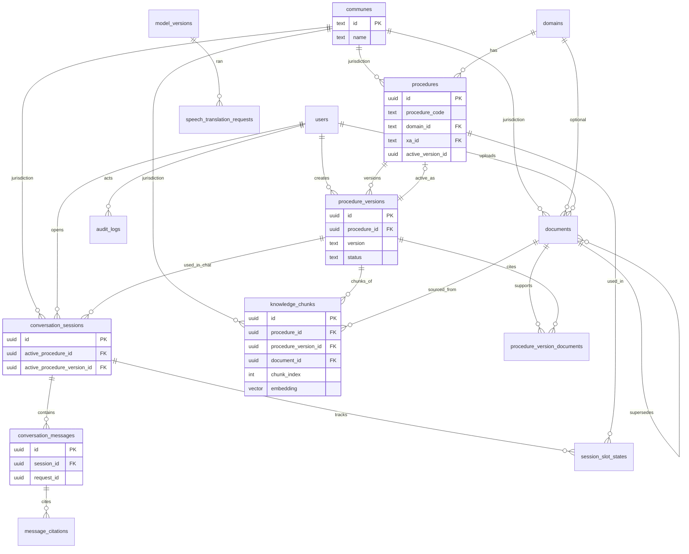

# Data Model (PostgreSQL + pgvector)

Khớp capstone proposal **§4.4**. Identity procedure/version không đổi.

`xa_id` FK → `communes.id` (V1: 1 xã; schema sẵn multi-xã).

**Nguyên tắc identity**

| | Technical pointer | Human-readable |
|--|-------------------|----------------|
| Procedure | `procedures.id` uuid — FK tên `procedure_id` | `procedure_code` e.g. `dk_khai_sinh` |
| Version | `procedure_versions.id` uuid | `version` e.g. `1.0.0` |

`UNIQUE (xa_id, procedure_code)` — cùng mã thủ tục được phép ở hai xã khác nhau.

Composite FK `(procedure_id, version_id)` đảm bảo không lệch procedure ↔ version.

**Proposal §4.4 (bắt buộc trong artifact):**

- Một dòng `documents` = một bản PDF đã version (có thể `supersedes_document_id`). **Không** tách `source_document` / `source_document_version`.
- N–N `procedure_version_documents` giữ nguyên (một version nhiều PDF; một PDF nhiều version).
- `procedure_versions` **không** còn `source_draft_id`, `approved_by`, `approved_at`.
- **Không** AI draft workspace → bảng `procedure_drafts` **ngoài V1**.
- Thêm `message_citations`, `model_versions`, `speech_translation_requests`.
- pgvector: cột `knowledge_chunks.embedding vector(1536)` — retrieval sau khi đủ slot, filter theo version ACTIVE đã pin.

### Delta so với `000001_init_schema` (đã apply local)

Migration đầu vẫn có `procedure_drafts` và cột duyệt. **Không sửa file up đã chạy.** Migration sau (khi làm admin/RAG/speech) phải:

| Thêm | Đổi | Bỏ khỏi V1 (không dùng / migrate drop khi an toàn) |
|------|-----|-----------------------------------------------------|
| `documents.version`, `supersedes_document_id` | `processing_status` có `READY` (map `PROCESSED`) | `procedure_drafts` |
| `procedure_version_documents.relationship_type`, `page_range`, `created_at` | | `procedure_versions.source_draft_id`, `approved_by`, `approved_at` |
| `message_citations` | | |
| `model_versions`, `speech_translation_requests` | | |

## 1. ER overview

```text
communes
  ├── procedures          (xa_id FK; id uuid PK; procedure_code)
  ├── documents           (versioned PDF; supersedes_document_id)
  ├── conversation_sessions
  └── knowledge_chunks

domains
  └── procedures          ← V1 công dân: ho_tich_chung_thuc

procedures
  ├── active: composite FK (id, active_version_id)
  │              → procedure_versions(procedure_id, id)
  └── procedure_versions
        ├── procedure_version_documents → documents
        └── knowledge_chunks  vector(1536) + chunk_index

users
  └── conversation_sessions
        ├── active: composite FK (active_procedure_id, active_procedure_version_id)
        ├── conversation_messages  (+ request_id uuid)
        │     └── message_citations
        └── session_slot_states

model_versions
  └── speech_translation_requests

audit_logs  (+ request_id uuid null)
```

## 2. Tracing — chỉ `session_id` + `request_id`

**Không** dùng `correlation_id` trong V1.

| ID | Scope |
|----|-------|
| `session_id` | Cả hội thoại |
| `request_id` | 1 HTTP / 1 turn (Web → Go → Python → LLM → DB/log) |

Messages: `request_id uuid NOT NULL`. Audit: `uuid null` (job/migration).

---

## 3. Embedding lock (V1)

| Hạng mục | Giá trị |
|----------|---------|
| Model | `text-embedding-3-small` (OpenAI) |
| Dimension | **1536** → `vector(1536)` |
| Đổi sau | Re-embed toàn bộ + migration |

---

## 4. ER diagram


```mermaid
erDiagram
    communes ||--o{ procedures : "jurisdiction"
    communes ||--o{ documents : "jurisdiction"
    communes ||--o{ conversation_sessions : "jurisdiction"
    communes ||--o{ knowledge_chunks : "jurisdiction"

    domains ||--o{ procedures : "has"
    domains ||--o{ documents : "optional"
    users ||--o{ conversation_sessions : "opens"
    users ||--o{ documents : "uploads"
    users ||--o{ procedure_versions : "creates"
    users ||--o{ audit_logs : "acts"

    conversation_sessions ||--o{ conversation_messages : "contains"
    conversation_sessions ||--o{ session_slot_states : "tracks"
    conversation_messages ||--o{ message_citations : "cites"
    procedures ||--o{ session_slot_states : "used_in"
    procedures ||--o{ procedure_versions : "versions"
    procedure_versions ||--o| procedures : "active_as"
    procedure_versions ||--o{ knowledge_chunks : "chunks_of"
    procedure_versions ||--o{ conversation_sessions : "used_in_chat"

    documents ||--o{ procedure_version_documents : "supports"
    documents ||--o{ documents : "supersedes"
    procedure_versions ||--o{ procedure_version_documents : "cites"
    documents ||--o{ knowledge_chunks : "sourced_from"
    model_versions ||--o{ speech_translation_requests : "ran"

    communes {
        text id PK
        text name
    }

    procedures {
        uuid id PK
        text procedure_code
        text domain_id FK
        text xa_id FK
        uuid active_version_id
    }

    procedure_versions {
        uuid id PK
        uuid procedure_id FK
        text version
        text status
    }

    knowledge_chunks {
        uuid id PK
        uuid procedure_id FK
        uuid procedure_version_id FK
        uuid document_id FK
        int chunk_index
        vector embedding
    }

    conversation_sessions {
        uuid id PK
        uuid active_procedure_id FK
        uuid active_procedure_version_id FK
    }

    conversation_messages {
        uuid id PK
        uuid session_id FK
        uuid request_id
    }
```

## 5. Tables

### `communes`

| Column | Type | Notes |
|--------|------|-------|
| id | text PK | = `xa_id`, e.g. `xa_chu_se` |
| name | text | e.g. `Chư Sê` |
| description | text null | e.g. Huyện Chư Sê, tỉnh Gia Lai |
| name | text | |
| description | text null | |
| is_active | boolean | default true |
| created_at | timestamptz | |

**Seed V1:** 1 row — `xa_chu_se` (Chư Sê, Gia Lai).

---

### `domains`

| Column | Type | Notes |
|--------|------|-------|
| id | text PK | |
| name | text | |
| description | text null | |
| sort_order | int | default 0 |
| is_active | boolean | default true |
| created_at | timestamptz | |

**Seed V1 công dân:** `ho_tich_chung_thuc`. Các domain đất đai / bảo hiểm có thể còn trong seed SQL nhưng **không** catalog công dân (proposal §1.6).

---

### `users`

| Column | Type | Notes |
|--------|------|-------|
| id | uuid PK | |
| role | text | `CHECK (role IN ('CITIZEN', 'ADMIN'))` |
| full_name | text | |
| email | text null | unique khi not null |
| phone | text null | |
| password_hash | text null | |
| created_at / updated_at | timestamptz | |

---

### `procedures`

| Column | Type | Notes |
|--------|------|-------|
| **id** | **uuid PK** | Technical identity — mọi FK gọi là `procedure_id` |
| **procedure_code** | **text NOT NULL** | Human code, e.g. `dk_khai_sinh` |
| domain_id | text FK → domains.id | |
| name | text | |
| xa_id | text FK → communes.id | |
| active_version_id | uuid null | |
| created_at | timestamptz | NOT NULL DEFAULT now() |
| updated_at | timestamptz | NOT NULL DEFAULT now() |
| **unique** | **`(xa_id, procedure_code)`** | Multi-xã: cùng code, khác xã |
| **unique** | **`(id, xa_id)`** | Hỗ trợ composite FK denorm `xa_id` trên chunks/sessions |

```sql
-- Composite FK: active version phải thuộc đúng procedure
FOREIGN KEY (id, active_version_id)
  REFERENCES procedure_versions (procedure_id, id)
```

API resolve: `(xa_id, procedure_code)` → `procedures.id`.

JSON definition dùng field **`procedure_code`** (không còn nhầm với uuid).

---

### `procedure_versions`

| Column | Type | Notes |
|--------|------|-------|
| id | uuid PK | |
| procedure_id | uuid FK → procedures.id | |
| version | text | semver |
| status | text | `DRAFT` \| `INDEXING` \| `ACTIVE` \| `ARCHIVED` |
| definition | jsonb | chứa `procedure_code`, slots, … |
| created_by | uuid FK → users | |
| created_at | timestamptz | |
| **unique** | `(procedure_id, version)` | |
| **unique** | `(procedure_id, id)` | cho composite FK |
| **partial unique** | `(procedure_id) WHERE status = 'ACTIVE'` | |

**Không có (proposal):** `source_draft_id`, `approved_by`, `approved_at`.

```text
DRAFT (sửa definition / chờ PDF)
    │
    ▼
INDEXING (chunk + embed)
   / \
fail   success → admin activate
 │        │
 ▼        ▼
DRAFT     ACTIVE ──► ARCHIVED
```

Fail embed → xóa chunks version đó → về `DRAFT` hoặc giữ `INDEXING` để retry. Chỉ ACTIVE được retrieval công dân.

---

### `procedure_version_documents`

| Column | Type | Notes |
|--------|------|-------|
| procedure_version_id | uuid FK | PK composite |
| document_id | uuid FK | PK composite |
| relationship_type | text | e.g. `primary`, `supporting` |
| page_range | text null | phục vụ citation |
| created_at | timestamptz | |

Tạo **cùng lúc upload** (proposal: không màn gắn nguồn thủ công). App-check `document.xa_id == procedure.xa_id` trước INSERT.

---

### `documents`

Một dòng = một bản PDF đã version (proposal: không tách bảng source + source_version).

| Column | Type | Notes |
|--------|------|-------|
| id | uuid PK | |
| xa_id | text FK → communes.id | |
| domain_id | text FK → domains null | |
| title | text | |
| document_number | text null | |
| issuer | text null | |
| version | text | bản văn bản (proposal) |
| supersedes_document_id | uuid null FK → documents.id | bản bị thay |
| filename | text | |
| storage_uri | text | MinIO/S3 |
| checksum | text | |
| effective_date / expiry_date / issued_date | date null | `000001` đang dùng `expire_date` |
| processing_status | text | `UPLOADED` \| `PROCESSING` \| `READY` \| `FAILED` |
| validation_status | text | `PENDING` \| `VALID` \| `EXPIRED` \| `SUPERSEDED` — `000001` tên `validity_status` |
| uploaded_by | uuid FK → users | |
| created_at / updated_at | timestamptz | |

Job index: `UPLOADED` → `PROCESSING` → `READY` \| `FAILED`. Activate version chỉ khi nguồn bắt buộc `READY`.

---

### `procedure_drafts` — **ngoài V1**

Proposal §1.6 / §4.2 loại AI draft workspace. Bảng còn trong `000001` nhưng artifact **không** dùng. Không tạo API/UI review draft.

---

### `knowledge_chunks` (pgvector)

| Column | Type | Notes |
|--------|------|-------|
| id | uuid PK | |
| xa_id | text FK → communes.id | |
| procedure_id | uuid | denorm; khóa bằng composite FK |
| procedure_version_id | uuid | |
| **document_id** | **uuid NOT NULL FK → documents** | V1: chunk luôn từ document (tránh UNIQUE NULL) |
| **chunk_index** | **int NOT NULL** | 0-based trong document |
| content | text | |
| metadata | jsonb | page, heading, embedding_model, … |
| embedding | vector(1536) | |
| created_at | timestamptz | |

```sql
FOREIGN KEY (procedure_id, procedure_version_id)
  REFERENCES procedure_versions (procedure_id, id)

-- Denorm xa_id không được lệch commune của procedure
FOREIGN KEY (procedure_id, xa_id)
  REFERENCES procedures (id, xa_id)

UNIQUE (procedure_version_id, document_id, chunk_index)
```

Citation/debug: Document A → chunk 0, 1, 2, …

---

### `message_citations`

Ghi đúng chunk / document / page đã dùng cho câu trả lời công dân (proposal §4.4).

| Column | Type | Notes |
|--------|------|-------|
| id | uuid PK | |
| message_id | uuid FK → conversation_messages | câu ASSISTANT |
| knowledge_chunk_id | uuid FK → knowledge_chunks null | |
| document_id | uuid FK → documents | |
| page_range | text null | |
| created_at | timestamptz | |

---

### `model_versions`

Trace checkpoint speech (RQ1/RQ2 → artifact).

| Column | Type | Notes |
|--------|------|-------|
| id | uuid PK | |
| architecture | text | `cascaded` \| `direct` |
| checkpoint_uri | text | |
| config | jsonb | decode, seed, data hash |
| created_at | timestamptz | |

---

### `speech_translation_requests`

| Column | Type | Notes |
|--------|------|-------|
| id | uuid PK | |
| request_id | uuid | khớp HTTP turn |
| session_id | uuid FK → conversation_sessions null | |
| model_version_id | uuid FK → model_versions | |
| audio_uri | text | MinIO, nếu được phép lưu |
| transcript_bahnar | text null | Cascaded |
| output_vi | text | |
| latency_ms | int | |
| status | text | `QUEUED` \| `OK` \| `FAILED` |
| created_at | timestamptz | |

---

### `conversation_sessions`

| Column | Type | Notes |
|--------|------|-------|
| id | uuid PK | |
| user_id | uuid FK → users null | |
| guest_token | text null | UNIQUE WHERE NOT NULL |
| xa_id | text FK → communes.id | |
| active_procedure_id | uuid null FK → procedures.id | |
| active_procedure_version_id | uuid null | |
| status | text | `OPEN` \| `COMPLETED` \| `ABANDONED` |
| created_at / updated_at | timestamptz | |

```sql
CHECK (
  (active_procedure_id IS NULL AND active_procedure_version_id IS NULL)
  OR (active_procedure_id IS NOT NULL AND active_procedure_version_id IS NOT NULL)
)

FOREIGN KEY (active_procedure_id, active_procedure_version_id)
  REFERENCES procedure_versions (procedure_id, id)

-- Khi đã chọn procedure: xa_id session phải khớp procedure
FOREIGN KEY (active_procedure_id, xa_id)
  REFERENCES procedures (id, xa_id)
```

(MATCH SIMPLE: khi `active_procedure_id` NULL thì FK commune-procedure không check — session vẫn có `xa_id` hợp lệ qua FK → communes.)

---

### `conversation_messages`

| Column | Type | Notes |
|--------|------|-------|
| id | uuid PK | |
| session_id | uuid FK | |
| request_id | uuid NOT NULL | |
| role | text | `USER` \| `ASSISTANT` \| `SYSTEM` |
| content | text | |
| action | text null | `DIRECT_ANSWER` \| `ASK_MISSING_SLOTS` \| `PROVIDE_FINAL_GUIDANCE` \| `OUT_OF_SCOPE` (NULL = user/system không decision) |
| message_metadata | jsonb | |
| created_at | timestamptz | |

---

### `session_slot_states`

Slot schema nằm trong **procedure_version.definition**, không chỉ trên procedure. Phải pin version.

| Column | Type | Notes |
|--------|------|-------|
| session_id | uuid FK → conversation_sessions ON DELETE CASCADE | |
| procedure_id | uuid | |
| **procedure_version_id** | **uuid NOT NULL** | Version đã dùng để collect slots |
| slot_state | jsonb | map slot → `{ value, status }` |
| updated_at | timestamptz | |
| **PK** | `(session_id, procedure_id)` | 1 row / procedure / session |

```sql
FOREIGN KEY (procedure_id, procedure_version_id)
  REFERENCES procedure_versions (procedure_id, id)
```

**Runtime V1:** một procedure trong session gắn version nào lúc bắt đầu thì **giữ version đó** đến hết flow (khớp `conversation_sessions.active_procedure_version_id`). Không âm thầm reuse slot state khi catalog đổi active version. Đổi version giữa chừng = **reset** slot state (hoặc migrate tường minh — không làm V1).

```text
Session.active_procedure_version_id = V003
        ↓
V003.definition.required_slots
        ↓
slot_state (procedure_version_id = V003)
        ↓
Decision Policy
```

---

### `audit_logs`

| Column | Type | Notes |
|--------|------|-------|
| id | bigserial PK | |
| request_id | uuid null | |
| actor_user_id | uuid FK → users null | |
| action | text | |
| entity_type | text | |
| entity_id | text | |
| payload | jsonb | |
| created_at | timestamptz | |

---

## 6. Publish flow (proposal §4.2)

```text
Admin tạo/mở procedure_version (definition JSON)
       ↓
Upload PDF + metadata
       ↓
INSERT documents
INSERT procedure_version_documents   (tự động, không màn gắn nguồn)
       ↓
Job: extract text → chunk → embed
     documents.processing_status: UPLOADED → PROCESSING → READY | FAILED
     procedure_versions.status = INDEXING
       ↓
Admin activate khi nguồn bắt buộc READY
       ↓
SHORT TXN: archive ACTIVE cũ → new ACTIVE + procedures.active_version_id
           + audit_logs
```

Không `procedure_drafts`. Rollback version cũ: optional.

### Embedding fail / retry

```text
embedding fail
      ↓
DELETE FROM knowledge_chunks WHERE procedure_version_id = :version_id
      ↓
documents.processing_status = FAILED  (hoặc retry PROCESSING)
      ↓
retry chunk + embed
```

### Short transaction (activate)

```text
BEGIN
  archive old active (cùng procedure_id)
  SET new.status = 'ACTIVE'
  UPDATE procedures SET active_version_id = new.id
  INSERT audit_logs (action = 'activate_procedure_version', ...)
COMMIT
```

### Activate validation (Go)

```text
VERIFY required documents.processing_status = 'READY'
VERIFY document.xa_id == procedure.xa_id
VERIFY definition JSON schema
```

---

## 6b. Chat version pin (slot state)

```text
DETECT procedure → pin active_procedure_version_id trên session
                 → UPSERT session_slot_states với cùng procedure_version_id
Decision đọc definition của version đã pin (không đọc “active mới nhất” của catalog)
```

## 7. Debug recipes

```sql
-- resolve code → uuid
SELECT id FROM procedures
WHERE xa_id = :xa AND procedure_code = 'dk_khai_sinh';

SELECT * FROM conversation_messages WHERE request_id = :rid;
SELECT * FROM conversation_messages WHERE session_id = :sid ORDER BY created_at;

SELECT pv.*
FROM procedures p
JOIN procedure_versions pv
  ON pv.id = p.active_version_id AND pv.procedure_id = p.id
WHERE p.xa_id = :xa AND p.procedure_code = 'dk_khai_sinh';

SELECT * FROM knowledge_chunks
WHERE procedure_version_id = :vid
ORDER BY document_id, chunk_index;
```

## 8. Constraints & indexes

| Rule | Enforce |
|------|---------|
| Multi-xã procedure code | `UNIQUE (xa_id, procedure_code)` |
| 1 draft → 1 version | **Bỏ** — không dùng draft V1 |
| version ↔ document cùng xã | **app-level** activate |
| Document dates | `expiry_date >= effective_date` |
| State machines | **CHECK IN (...)** (migration; không PG ENUM) |
| 1 active / procedure | partial unique + short txn |
| Embed fail | delete chunks → retry |

```text
procedures (xa_id, procedure_code) UNIQUE
procedures (id, xa_id) UNIQUE
procedures (id, active_version_id) composite FK
conversation_sessions (active_procedure_id, active_procedure_version_id)
knowledge_chunks (procedure_version_id, document_id, chunk_index) UNIQUE
knowledge_chunks USING hnsw (embedding vector_cosine_ops)

procedure_versions.status IN ('DRAFT','INDEXING','ACTIVE','ARCHIVED')
documents.processing_status IN ('UPLOADED','PROCESSING','READY','FAILED')
```

## 8b. ON DELETE (migration — không đổi ER)

| FK | ON DELETE | Lý do |
|----|-----------|-------|
| `conversation_messages.session_id` | **CASCADE** | Xóa session → xóa messages |
| `session_slot_states.session_id` | **CASCADE** | |
| `procedure_versions.procedure_id` | **RESTRICT** | Version đã publish = lịch sử |
| `knowledge_chunks.procedure_version_id` | **RESTRICT** | Không xóa version còn chunks |
| `procedure_version_documents.*` | **RESTRICT** | |
| `documents` đã gắn version | **RESTRICT** | |
| `audit_logs.actor_user_id` | **SET NULL** | Giữ audit khi xóa user |
| `source_draft_id` | — | Cột ngoài V1; migration sau mới drop |

## 9. Implement order → migration

1. `communes` (+ seed)  
2. `domains`  
3. `users`  
4. `procedures` + `procedure_versions` (không `source_draft_id`)  
5. `conversation_*` + `session_slot_states` + `message_citations`  
6. `documents` (version, supersedes) + `procedure_version_documents` (relationship, page_range)  
7. `knowledge_chunks` (`vector(1536)`)  
8. `model_versions` + `speech_translation_requests`  
9. `audit_logs`  

`000001` đã làm 1–8 theo bản draft cũ. Bước tiếp = migration mới theo delta ở đầu file — **không** sửa file up đã chạy.

## 10. Changelog

| Thay đổi | Lý do |
|----------|-------|
| Bỏ draft workspace khỏi V1 | Proposal §1.6, §4.2 |
| `documents.version`, `supersedes_document_id` | Proposal §4.4 |
| `procedure_version_documents.relationship_type`, `page_range` | Proposal §4.4 |
| `message_citations`, `model_versions`, `speech_translation_requests` | Proposal §4.4 |
| pgvector chỉ cho RAG chunk | Proposal §4.3 |
